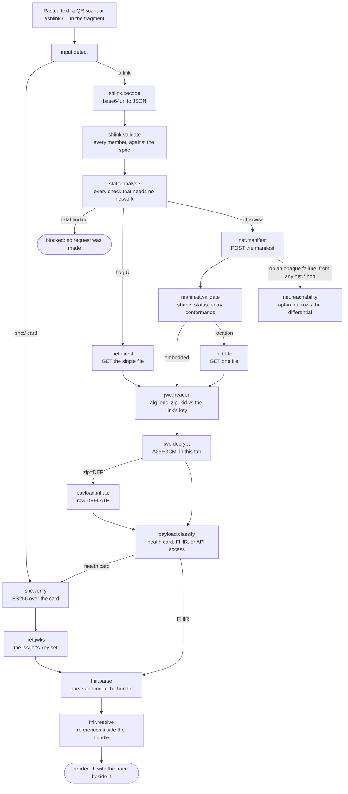

# Loupe

A SMART Health Link viewer, debugger and teaching tool that runs entirely in one
browser tab. No backend, no upload, no account. You paste a link and it shows you
every step it takes, what each step observed, and who has to act when a step
fails.

## The problem it exists to solve

A real link, sent in good faith at a testing event:

```
https://localhost:5173/api/shl-manifest?bid=4836470
```

The sender had tested it and it worked. It always works, for them: `localhost` names
the machine doing the asking, so it resolves to whichever computer opens it, and can
only ever open on the machine that minted it.

The viewer everyone reaches for reported `TypeLoad failed`. That is not a protocol
error or an error code: the browser rejected the fetch with `TypeError: Load
failed`, the viewer stringified the exception, and a `.replaceAll("Error: ", '')`
meant to tidy a prefix ate the middle of `TypeError`. So the recipient saw a broken
viewer, the sender saw a link that worked, and the finding, which needed no network
access at all, was never stated.

Loupe states it before making any request: this link points at the sender's own
machine, so nobody else can open it. It also notices that `?bid=4836470` carries
nowhere near the entropy the specification requires, so other people's manifests
can be enumerated by counting, and that port 5173 is a development server.

## What it can do

- **Decide offline first.** Loopback and private-network hosts, unresolvable names,
  ephemeral tunnels, dev-server ports, `http` under an `https` viewer, userinfo,
  invisible characters, guessable identifiers, expiry in the past or in milliseconds,
  illegal flag combinations. A fatal finding stops the run rather than spending a
  request to learn what the URL already said.
- **Name who has to act.** Every finding carries an audience: you, the sender, the
  server's operator, or nobody. That is what ends the "it works for me" argument.
- **Show the whole path.** Each hop keeps its request, response, status, timing and
  the clause it was judged against, including which response headers the browser let
  script read, and copies out as a `curl` command with the key redacted.
- **Narrow an opaque failure.** A browser will not say why a fetch failed, so Loupe
  ranks a differential (CORS, DNS, TLS, refused, extension, mixed content) and offers
  probes that eliminate branches. Two of those talk to a third party, so they are off
  by default.
- **Prove a key mismatch.** A JWE `kid` here is the RFC 7638 thumbprint of the link's
  own key, so a wrong key is demonstrated rather than inferred from an opaque
  authentication-tag failure.
- **Identify the family before assuming the protocol.** One payload shape is reused
  by HL7, WHO, IHE and KTC over three incompatible retrieval protocols, so a
  different profile is reported as a different profile, never as a broken link.
- **Work with no network.** Offline mode runs the same pipeline over a manifest, a JWE
  or a bundle you have, and the sandbox mints broken links to test another viewer.

## Compared with the SMART Health Card Web Reader

The incumbent is `the-commons-project/shc-web-reader`, deployed at viewer.tcpdev.org
and as the CommonHealth viewer. Every row is a fact established by reading that
source at commit `e61c8799`, with file and line references in
[`research/03-shc-web-reader-teardown.md`](research/03-shc-web-reader-teardown.md).
Its FHIR rendering work is genuinely good, which is why Loupe builds on it.

|                                 | Web Reader                                                                                 | Loupe                                                          |
| ------------------------------- | ------------------------------------------------------------------------------------------ | -------------------------------------------------------------- |
| Payload checked before fetching | No. `shlPayload.url` is never inspected                                                    | Every static rule, and a fatal one stops the run               |
| Failure attribution             | One `try`/`catch` over six hops, then `err.toString()`                                     | Per-step status, with the hop named                            |
| HTTP exchange kept              | No. Every `Response` is consumed and dropped                                               | Request, response, headers, timing, per hop                    |
| Status on the file `GET`        | Not checked, so a 403 on an expired location URL reaches the decrypter as if it were a JWE | Checked, and an expired single-use location is its own finding |
| `zip: DEF`                      | Fails. `jose@4`'s browser inflate is a throwing stub, and the message blames your browser  | Inflated with `fflate`, and reported                           |
| `application/smart-api-access`  | Silently skipped, with no note that a file was dropped                                     | Classified and shown                                           |
| `embeddedLengthMax`             | Never sent, so both manifest paths cannot be exercised                                     | Sent, and editable                                             |
| `recipient`                     | Hardcoded `'SMART Health Card Web Reader'`                                                 | Editable, so a server operator's log names the caller          |
| `U` with `P`                    | Not rejected. The user is prompted for a passcode that is discarded                        | Refused, citing the clause                                     |
| One bad file                    | `DataMissingError` from one empty bundle aborts the whole display                          | Per-file outcomes; the files that opened still render          |
| A throwing renderer             | No error boundary anywhere, so a blank white page (issue #146)                             | Boundary per resource                                          |
| An unsigned payload             | Renders nothing where the verification posture would go                                    | States that nothing here is signed                             |
| Requests in flight              | No `AbortController`, no timeout, and no tests anywhere                                    | One cancellable transport seam, and a test suite               |
| Offline code display            | **Better.** Ships LOINC and SNOMED CT snapshots (7.9 MB)                                   | Nothing shipped; a code is shown as the payload wrote it       |
| Languages                       | **Better.** English and French                                                             | English only                                                   |

## Quick start

```sh
pnpm install
pnpm dev            # http://localhost:5173
pnpm typecheck      # tsc --noEmit
pnpm test           # vitest run
pnpm lint           # eslint, zero warnings tolerated
pnpm build          # typecheck then a static bundle in dist/
```

`dist/` is self-contained and path-independent (`base: './'`), so it serves from any
prefix or opens from `file://`. Deployment, including the container image and the
port-forward the tool is used through at an event, is in
[`deploy/README.md`](deploy/README.md).

## Architecture

One pipeline, recorded as data. `src/core/pipeline.ts` is a flat sequence of named
steps against a `Recorder` (`src/core/trace.ts`), not a promise chain with one
`try`/`catch` around it, because a collapsed six-hop failure is the defect this
tool exists to correct. Each box below is a `StepKind`, and each appears in the
trace with its own status, evidence and timing.



Four rules hold it together, and [CONTRIBUTING.md](CONTRIBUTING.md) states them as
contributor rules. **A run is data**, so it serialises to JSON, which is what makes
"copy this diagnosis into chat" possible and a run replayable with no network. **The
network is one seam** (`src/core/net/transport.ts`), so offline mode and tests are
the same code path as a real fetch, and a lint rule fails a bare `fetch` anywhere
else. **Per-file work is independent**, so one undecryptable file does not discard
the ones that opened. And **secrets are registered, not stripped**, so redaction
happens once at the export boundary (`redactRun`): an earlier design redacted on
write and leaked the key in the one step that recorded a payload before the key was
registered.

## Adding a diagnosis rule

Static rules live in `src/core/diagnose/rules.ts` as entries in `STATIC_RULES`. A
rule is a pure function of a `DiagnosisContext` (the parsed URL, its raw text, the
link, the viewer's own origin, the current time), returning a finding or nothing.

```ts
{
  id: 'SHL-URL-DEV-PORT',
  about: 'The URL uses a well-known development server port.',
  evaluate: ({ url }) => {
    const what = url.port ? DEV_SERVER_PORTS[url.port] : undefined;
    // On loopback this adds nothing: the loopback rule already said it all.
    if (!what || classifyHost(url.hostname).reach === 'loopback') return undefined;
    return { ruleId: 'SHL-URL-DEV-PORT', severity: 'info', audience: 'sender',
      title: `Port ${url.port} is ${what}.`, detail: '…' };
  },
}
```

Four things a new rule owes its reader. The `id` is stable and quotable, because a
report cites it and a conversation refers to it. `severity: 'fatal'` stops the run,
so use it only when nothing further can usefully be attempted. `audience` names who
has to act. And the `title` is one plain sentence somebody can act on, with no
jargon and no hedging: the wording is the product. Then add a test beside the module
asserting what a specific input produces. [CONTRIBUTING.md](CONTRIBUTING.md) covers
renderers, fixtures and broken presets.

## Privacy posture

The tool handles other people's clinical data on borrowed laptops, so this is a
design constraint rather than a policy page.

- **Nothing is uploaded**, because there is no backend to upload to. Decryption
  happens in the tab with WebCrypto, every request Loupe makes is in the trace, and
  none is made that you did not ask for: the reachability and DNS probes are opt-in,
  the DNS one because it reaches a third-party resolver.
- **Nothing is fetched from anywhere else, ever.** No CDN, no web font, no icon
  host, no analytics. The QR decoder's WASM is served from the same bundle. Loupe
  renders identically with the network unplugged, which matters when the venue
  wifi is itself the thing under investigation.
- **A payload cannot beacon.** The Content-Security-Policy deliberately omits
  `https:` from `img-src`, so a remote `Attachment.url` in somebody's bundle cannot
  phone home just by being rendered.
- **Only preferences persist.** `localStorage` holds the theme, the recipient string
  and the probe toggles. No link, key, passcode or payload is ever written to it, and
  anything exported goes through the redactor first, so a copied command carries
  `[key redacted]`, not the key.

## Notices

There is no `LICENSE` file in this repository yet. Third-party notices, including the
MIT notice retained from `the-commons-project/shc-web-reader`, are in
[THIRD-PARTY-NOTICES.md](THIRD-PARTY-NOTICES.md).
