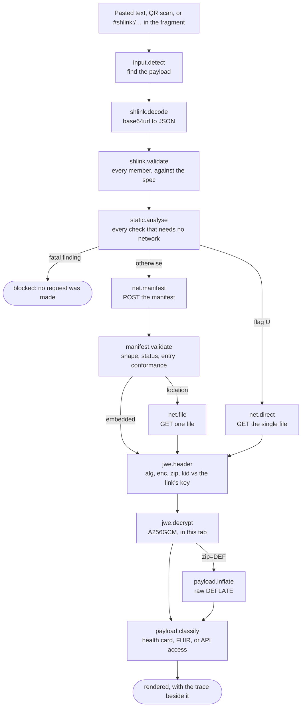

# Loupe

A SMART Health Link viewer, debugger and teaching tool that runs entirely in one
browser tab. No backend, no upload, no account. You paste a link and it shows you
every step it takes, what each step observed, and who has to act when a step
fails.


<!-- Capture as docs/screenshot-trace.png: the Open screen after a run that stopped
     at "Inspect the manifest URL", with the loopback finding expanded. -->

## The problem it exists to solve

A real link, sent in good faith at a testing event:

```
https://localhost:5173/api/shl-manifest?bid=4836470
```

The sender had tested it and it worked. It always works, for them: `localhost`
names the machine doing the asking, so that link resolves to whichever computer
opens it. It can only ever open on the machine that minted it.

The viewer everyone reaches for reported `TypeLoad failed`. That string is not a
protocol error. The browser rejected the fetch, the message was
`TypeError: Load failed`, and a `.replaceAll("Error: ", '')` in the viewer ate
the middle of the word. So the recipient saw a broken viewer, the sender saw a
link that worked, and the actual finding, which needed no network access at all,
was never stated.

Loupe says it in one sentence before it makes any request. And because the URL is
also on the Vite dev-server port with a sequential identifier, it says two more
true things at the same time: this is a development server, and `?bid=4836470`
carries nowhere near the entropy the specification requires, so the links are
enumerable.

## What it can do

- **Decide offline first.** Everything knowable from the payload is decided before
  a request is issued: loopback and private-network hosts, unresolvable names,
  ephemeral tunnels, dev-server ports, `http` under a `https` viewer, userinfo,
  invisible characters, expiry in the past or in milliseconds, flag combinations.
  A fatal finding stops the run rather than spending a request to learn what the
  URL already said.
- **Name who has to act.** Every finding carries an audience: you, the sender, the
  server's operator, or nobody. That is the sentence that ends the "it works for
  me" conversation at a table.
- **Show the whole path.** Each hop keeps its request, its response, its status,
  its timing and the specification clause it was judged against, including which
  response headers a browser was allowed to let script read and which it was not.
- **Narrow an opaque failure.** A browser will not tell JavaScript why a fetch
  failed. Loupe offers a differential: CORS, DNS, TLS, connection refused, an
  extension, mixed content, and opt-in probes that eliminate branches. Probes are
  off by default because two of them talk to a third party.
- **Prove a key mismatch.** When a JWE header carries a `kid`, it is the RFC 7638
  thumbprint of the link's own key, so a wrong key is demonstrated rather than
  inferred from an opaque authentication-tag failure.
- **Hand over a reproduction.** Any hop copies out as a `curl` or PowerShell
  command, with the decryption key redacted, so the server's operator can run the
  same request without Loupe.
- **Run with no network.** Offline mode puts the same pipeline over a manifest
  response, a JWE or a bundle you already have.
- **Mint deliberately broken links.** The sandbox produces links, including
  invalid ones, to test somebody else's viewer.
- **Teach.** Every field is annotated with the specification text it comes from,
  and every check the tool runs is listed with what it looks for.

## Quick start

```sh
pnpm install
pnpm dev            # http://localhost:5173
```

```sh
pnpm typecheck      # tsc --noEmit
pnpm test           # vitest run
pnpm lint           # eslint, zero warnings tolerated
pnpm build          # typecheck then a static bundle in dist/
```

`dist/` is self-contained and path-independent (`base: './'`), so it can be served
from any prefix, or opened from `file://`. Deployment, including the container
image and the port-forward the tool is used through at an event, is in
[`deploy/README.md`](deploy/README.md).

## Architecture

One pipeline, recorded as data. `src/core/pipeline.ts` is a flat sequence of named
steps against a `Recorder` (`src/core/trace.ts`), not a promise chain with one
`try`/`catch` around it, because a collapsed six-hop failure is the defect this
tool exists to correct.



Four rules hold it together.

1. **A run is data.** It serialises to JSON, which is what makes "copy this
   diagnosis into chat" possible and what makes a run replayable in a test with
   no network.
2. **The network is one seam.** Everything goes through `Transport`
   (`src/core/net/transport.ts`), so offline mode and tests are the same code path
   as a real fetch, and nothing can reach the network without appearing in the
   trace.
3. **Per-file work is independent.** One undecryptable file does not discard the
   ones that opened.
4. **Secrets are registered, not stripped.** The run holds the truth, because the
   person looking at it is holding the link and is entitled to see their own key.
   Redaction happens once, at the export boundary (`redactRun`), and masking
   happens in the UI. An earlier design redacted on write and leaked the key in
   the one step that recorded a payload before the key was registered.

## Adding a diagnosis rule

Static rules live in `src/core/diagnose/rules.ts` as entries in `STATIC_RULES`.
A rule is a pure function of a `DiagnosisContext` (the parsed URL, the raw URL
text, the link, the viewer's own origin, and the current time), returning a
finding or `undefined`.

```ts
{
  id: 'SHL-URL-DEV-PORT',
  about: 'The URL uses a well-known development server port.',
  evaluate: ({ url }) => {
    const description = url.port ? DEV_SERVER_PORTS[url.port] : undefined;
    if (!description) return undefined;
    // On loopback this adds nothing: the loopback rule already said it all.
    if (classifyHost(url.hostname).reach === 'loopback') return undefined;
    return {
      ruleId: 'SHL-URL-DEV-PORT',
      severity: 'info',
      audience: 'sender',
      title: `Port ${url.port} is ${description}.`,
      detail: '…',
    };
  },
}
```

Four things a new rule owes its reader. The `id` is stable and quotable, because
a report cites it and a conversation refers to it. `severity: 'fatal'` stops the
run, so use it only when nothing further can usefully be attempted. `audience`
names who has to act. And the `title` is one plain sentence somebody can act on,
with no jargon and no hedging: the wording is the product.

Then add a test beside the module (`src/core/diagnose/rules.test.ts`) asserting
what a specific input produces. See [CONTRIBUTING.md](CONTRIBUTING.md) for
renderers and fixtures.

## Privacy posture

The tool handles other people's clinical data on borrowed laptops at events, so
this is a design constraint rather than a policy page.

- **Nothing is uploaded.** There is no backend to upload to. Decryption happens
  in the tab, with WebCrypto.
- **Every request is in the trace.** The one transport seam exists partly to make
  that guarantee structural rather than aspirational.
- **No request is made that you did not ask for.** The reachability and DNS probes
  are opt-in, and the DNS one is opt-in specifically because it reaches a
  third-party resolver.
- **Nothing is fetched from anywhere else, ever.** No CDN, no web font, no icon
  host, no analytics. The QR decoder's WASM is served from the same bundle. The
  tool renders identically with the network unplugged, which matters when venue
  wifi is itself the thing under investigation.
- **A payload cannot beacon.** The Content-Security-Policy deliberately omits
  `https:` from `img-src`, so a remote `Attachment.url` in somebody's bundle
  cannot phone home just by being rendered.
- **Only preferences persist.** `localStorage` holds theme, recipient string and
  probe toggles. No link, key, passcode or payload is ever written to it.
- **Secrets never leave the tab.** Anything exported goes through the redactor
  first, so a copied command or a shared report carries `[key redacted]` rather
  than the key.

## Licence and notices

Third-party notices, including the MIT notice retained from
`the-commons-project/shc-web-reader` for the FHIR display groundwork this project
builds on, are in [THIRD-PARTY-NOTICES.md](THIRD-PARTY-NOTICES.md).
